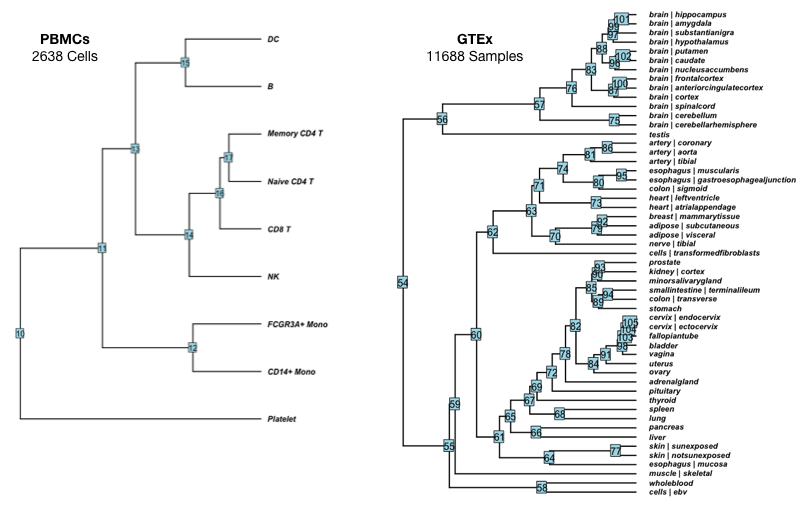

<!-- README.md is generated from README.Rmd. Please edit that file -->

# Generative Nextflow

A Proof-of-Concept for Dynamic Hierarchical Workflows via Nextflow


#### The Concept

A workflow built with Nextflow is typically made up of a set of
pre-defined steps and an explicitly defined workflow. But what if the
workflow steps are dynamic depending on the data. Can we (*or should
we*) make dynamics workflows that are generated based on the structure
of the data?

Imagine a dataset of samples with a hierarchical structure:

``` 
     A
    / \
   /   B 
  /   / \
 C   D   E 
```

We need to compute some arbitrary process for each node in the tree,
however the calculation for each node is also dependent on the output of
the parent node. In this case, A needs to be processed first, then B and
C can be computed in parallel. Once B is finished, D and E can be
computed in parallel etc. If we needed to do this repetitively for the
same data and structure, we might define a workflow. But what if we want
to apply the same method to a dataset with a different structure? We
would want to automate the generation of these workflows.

Typically when:

  - Processing many datasets with different hierarchies
  - Large hierarchies with many branch points
  - Compute requires high-performance architectures
  - Parallelization becomes important

#### Useful Applications

In genomics, data often has a hierarchical structure.



For example the left shows clustering of immune cells from scRNA-seq
data of PBMCs. If modeling this data with a shared learning approach,
modeling each cell type might depend on information up the hierarchy.
Therefore it would make sense to build a workflow that starts at the
root of the tree. But what if we want to use the same modeling approach
to a hierarchy of tissue-specific RNA-seq samples from GTEx? We could
simply re-generate the workflow with this new structure and some minor
adjustments to the file paths and parameters.

While this is a niche example, this idea can be applied to any dynamic
hierarchical workflow. Here is a lightweight proof-of-concept in Python
for implementing the described idea.

#### A Basic Example

``` 
     A
    / \
   /   B 
  /   / \
 C   D   E 
```

Generating workflows dynamically requires two things. 1) A file defining
the hierarchy of processes and 2) A representation of the individual
workflow components that are pieced together. Workflow components can be
simple multi-line strings that are not modified (e.g. the workflow
header) or they are modules with placeholders (e.g. workflow processes).
Modules are essentially reusable templates for Nextflow processes.

##### Hierarchy Definition

The hierarchy definition defines the workflow structure (e.g. which
processes are data-dependent) as well as the processes themselves.

    example.csv
    
    process,module,params
      -> A,echo,word=cat
    A -> B,join,word=bird
    A -> C,join,word=horse
    B -> D,join,word=lion
    B -> E,join,word=fish

1.  Outputs can be used as inputs to one or more processes
      - Parent nodes can have multiple children  
      - Child nodes have a single parent  
2.  Modules can be repeatable or different  
3.  Modules can take one or more keyword arguments

Based on the above example, we need to process **A** with the `echo`
module which takes the keyword argument `word` while **B**, **C**,
**D**, **E** are processed with the `join` module which also takes the
same argument. Computing A depends on nothing, while computing **B**
depends on **A** and so on.

``` python
import gnf

df = gnf.read_data("example.csv")
tree = gnf.build_tree(df)
```

Here we read in the data and create a tree to represent the workflow.
The tree starts are the root and can be traversed.

``` python
print(tree.children[0]) # The first child of the root
```

    # Generative_Node('->A->B', 
    #                 label='B', 
    #                 module='join', 
    #                 params='word=bird',
    #                 kwargs={'word': 'bird', 'child': 'B', 'parent': 'A'})

``` python
# View tree
gnf.print_tree(tree)
```

    # A [echo]
    # word: cat
    # |
    # |-- B [join]
    # |   word: bird
    # |   |
    # |   |-- D [join]
    # |   |   word: lion
    # |   |   
    # |   +-- E [join]
    # |       word: fish
    # |       
    # +-- C [join]
    #     word: horse

Here the dependency structure is defined, the module required for each
process, as well as the keyword arguments that module may take. All of
this information is stored as object properties representing the node.
As we traverse the tree to build the workflow, we can remember the
dependencies as well as the properties of each process.

##### Module Definition

Workflow modules are templates of Nextflow processes that are populated
by the node properties (`kwargs`).

``` python
class Modules(Components):

    @gnf.pretty_format
    def echo(self, **kwargs):
        return('''\
        process {child} {{
            output:
            stdout into {child}

            """
            printf {word}
            """
        }}
        '''.format(**kwargs))

    @gnf.pretty_format
    def join(self, **kwargs):
        return('''\
        process {child} {{
            input:
            val x from {parent}

            output:
            stdout into {child}

            """
            printf "${{x}}_{word}"
            """
        }}
```

Modules take any number of keyword arguments through the elegant string
formatting ability of Python. When traversing the tree, for each node,
we find the object method described for the specific module, and pass
the parent, child, and keyword arguments to the method, writing the
filled template to the workflow file.

Each module is defined as a method of a larger Modules class, which
inherits a Components object that has basic snippets that common
workflows and configuration files will need. Both of these can be
modified, but you’ll mostly need to describe the Modules object.

``` python
m = Modules()

with open('workflow.nf', 'w') as workflow:

    # Can put arbitray code before workflow processes
    workflow.write(m.workflow_shebang())

    # Traverse the tree by a level order strategy
    for node in gnf.traverse_tree(tree):

        # Find the module specified by the node
        module = getattr(m, node.module)

        # Fill in the module template with the kwargs
        workflow.write(module(**node.kwargs))

    # Can put arbitrary code after the workflow processes
    workflow.write(m.workflow_view())
```

The result is a workflow file

    #!/usr/bin/env nextflow
    process A {
        output:
        stdout into A
    
        """
        printf cat
        """
    }
    process B {
        input:
        val x from A
    
        output:
        stdout into B
    
        """
        printf "${x}_bird"
        """
    }
    process C {
        input:
        val x from A
    
        output:
        stdout into C
    
        """
        printf "${x}_horse"
        """
    }
    process D {
        input:
        val x from B
    
        output:
        stdout into D
    
        """
        printf "${x}_lion"
        """
    }
    process E {
        input:
        val x from B
    
        output:
        stdout into E
    
        """
        printf "${x}_fish"
        """
    }
    A.view { it }
    B.view { it }
    C.view { it }
    D.view { it }
    E.view { it }

Running it looks like this:

    # cat
    # cat_bird
    # cat_horse
    # cat_bird_fish
    # cat_bird_lion

This is a very basic example, but this simple syntax can scale with
limited additional code up to very large workflows. If you get the point
by now feel free to stop reading. Below shows how this scales up to
larger workflows, including a slightly larger toy example that requires
scripts, and a slightly larger than that example showing why this is
useful for genomics.

#### Slightly More Complicated

    example.csv
    
    process,module,params
      -> A,multiply,value=5|multiplier=5
    A -> B,add,value=10
    A -> C,add,value=2
    B -> D,add,value=4
    B -> E,add,value=9

Here the modules are actually calling scripts and saving the output to
files which is more realistic.

``` python
class Modules(gnf.Components):

    @gnf.pretty_format
    def multiply(self, **kwargs):
        return('''\
        process {child} {{
            publishDir "$params.output/values"

            output:
            file '*.txt' into {child}

            script:
            """
            python $PWD/scripts/multiply.py {value} {multiplier} {child}.txt
            """
        }}
        '''.format(**kwargs))

    @gnf.pretty_format
    def add(self, **kwargs):
        return('''\
        process {child} {{
            publishDir "$params.output/values"

            input:
            file prior from {parent}

            output:
            file '*.txt' into {child}

            script:
            """
            prior=\\$(cat $prior)
            python $PWD/scripts/add.py \\$prior {value} {child}.txt
            """
        }}
        '''.format(**kwargs))
```

We’ll also add a configuration file and add some more components to the
workflow.

``` python
m = Modules()

with open('workflow.config', 'w') as config:
    config.write(m.config_manifest())
    config.write(m.config_profiles())
    config.write(m.config_params())
    
with open('workflow.nf', 'w') as workflow:

    workflow.write(m.workflow_shebang())
    workflow.write(m.workflow_version())
    workflow.write(m.workflow_header(tree))

    for node in gnf.traverse_tree(tree):
        module = getattr(m, node.module)
        workflow.write(module(**node.kwargs))
```

The beginning of the workflow looks like this:

    #!/usr/bin/env nextflow
    VERSION="1.0"
    log.info """
    
    W O R K F L O W ~ Configuration
    ===============================
    output    : ${params.output}
    -------------------------------
    Hierarchy
    
    A
    |-- B
    |   |-- D
    |   +-- E
    +-- C
    
    """
    process A {
        publishDir "$params.output/values"
    
        output:
        file '*.txt' into A
    
        script:
        """
        python $PWD/scripts/multiply.py 5 5 A.txt
        """
    }
    process B {
        publishDir "$params.output/values"
    
        input:
        file prior from A
    
        output:
        file '*.txt' into B
    
        script:
        """
        prior=\$(cat $prior)
        python $PWD/scripts/add.py \$prior 10 B.txt
        """
    }

#### A Real Example

In this example we’ll use the same hierarchy, except nodes represent
groups of samples that need to be processed together, similar to the
genomics applications previously mentioned. We’ll apply a model to the
groups (leaf nods) that can optionally take prior information from
models of group supersets in the hierarchy (internal and root nodes).

    process,module,params
      -> A,model,cores=1|iter=10000|data=/Users/anthonyfederico/dat.rds|groups=C_D_E
    A -> B,model_prior,cores=1|iter=10000|data=/Users/anthonyfederico/dat.rds|groups=D_E
    A -> C,model_prior,cores=1|iter=10000|data=/Users/anthonyfederico/dat.rds|groups=C
    B -> D,model_prior,cores=1|iter=10000|data=/Users/anthonyfederico/dat.rds|groups=D
    B -> E,model_prior,cores=1|iter=10000|data=/Users/anthonyfederico/dat.rds|groups=E

``` python
import gnf

df = gnf.read_data("example.csv")

tree = gnf.build_tree(df)
gnf.print_tree(tree)
```

    # A [model]
    # cores: 1
    # iter: 10000
    # data: /Users/anthonyfederico/dat.rds
    # groups: C_D_E
    # |
    # |-- B [model_prior]
    # |   cores: 1
    # |   iter: 10000
    # |   data: /Users/anthonyfederico/dat.rds
    # |   groups: D_E
    # |   |
    # |   |-- D [model_prior]
    # |   |   cores: 1
    # |   |   iter: 10000
    # |   |   data: /Users/anthonyfederico/dat.rds
    # |   |   groups: D
    # |   |   
    # |   +-- E [model_prior]
    # |       cores: 1
    # |       iter: 10000
    # |       data: /Users/anthonyfederico/dat.rds
    # |       groups: E
    # |       
    # +-- C [model_prior]
    #     cores: 1
    #     iter: 10000
    #     data: /Users/anthonyfederico/dat.rds
    #     groups: C

``` python
class Modules(gnf.Components):

    @gnf.pretty_format
    def model(self, **kwargs):
        return('''\
        process {child} {{
            cache "deep"
            publishDir "$params.output/models", pattern: "*.rds", mode: "copy"
            publishDir "$params.output/logs", pattern: "*.log", mode: "copy"

            output:
            file '*.rds' into {child}_rds
            file '*.log'

            script:
            """
            Rscript $PWD/scripts/model.R \\\\
            --data {data} \\\\
            --name {child} \\\\
            --groups {groups} \\\\
            --cores {cores} \\\\
            --iter {iter}
            """
        }}
        '''.format(**kwargs))

    @gnf.pretty_format
    def model_prior(self, **kwargs):
        return('''\
        process {child} {{
            cache "deep"
            publishDir "$params.output/models", pattern: "*.rds", mode: "copy"
            publishDir "$params.output/logs", pattern: "*.log", mode: "copy"

            input:
            file prior from {parent}_rds

            output:
            file '*.rds' into {child}_rds
            file '*.log'

            script:
            """
            Rscript $PWD/scripts/model.R \\\\
            --data {data} \\\\
            --prior ${{prior}} \\\\
            --name {child} \\\\
            --groups {groups} \\\\
            --cores {cores} \\\\
            --iter {iter}
            """
        }}
        '''.format(**kwargs))
```

``` python
m = Modules()

with open('workflow.config', 'w') as config:
    config.write(m.config_manifest())
    config.write(m.config_profiles())
    config.write(m.config_params())

with open('workflow.nf', 'w') as workflow:
    workflow.write(m.workflow_shebang())
    workflow.write(m.workflow_version())
    workflow.write(m.workflow_header(tree))

    for node in gnf.traverse_tree(tree):
        module = getattr(m, node.module)
        workflow.write(module(**node.kwargs))

    workflow.write(m.workflow_complete())
```

The beginning of the workflow looks like this.

    #!/usr/bin/env nextflow
    VERSION="1.0"
    log.info """
    
    W O R K F L O W ~ Configuration
    ===============================
    output    : ${params.output}
    -------------------------------
    Hierarchy
    
    A
    |-- B
    |   |-- D
    |   +-- E
    +-- C
    
    """
    process A {
        cache "deep"
        publishDir "$params.output/models", pattern: "*.rds", mode: "copy"
        publishDir "$params.output/logs", pattern: "*.log", mode: "copy"
    
        output:
        file '*.rds' into A_rds
        file '*.log'
    
        script:
        """
        Rscript $PWD/scripts/model.R \\
        --data /Users/anthonyfederico/dat.rds \\
        --name A \\
        --groups C_D_E \\
        --cores 1 \\
        --iter 10000
        """
    }
    process B {
        cache "deep"
        publishDir "$params.output/models", pattern: "*.rds", mode: "copy"
        publishDir "$params.output/logs", pattern: "*.log", mode: "copy"
    
        input:
        file prior from A_rds
    
        output:
        file '*.rds' into B_rds
        file '*.log'
    
        script:
        """
        Rscript $PWD/scripts/model.R \\
        --data /Users/anthonyfederico/dat.rds \\
        --prior ${prior} \\
        --name B \\
        --groups D_E \\
        --cores 1 \\
        --iter 10000
        """
    }

#### Contributing

If you find this prototype useful or you have thoughts/suggestions
please let me know. Any feedback is welcome.
